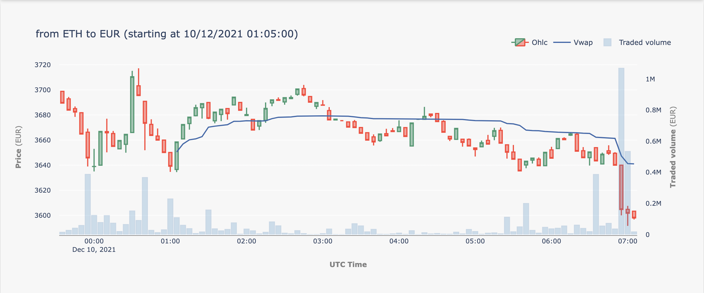
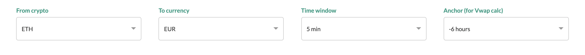
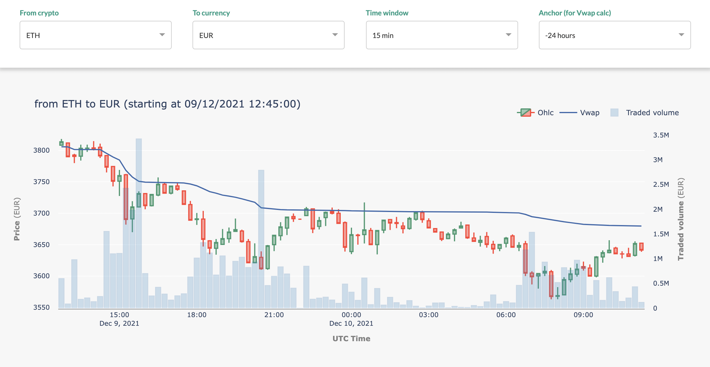
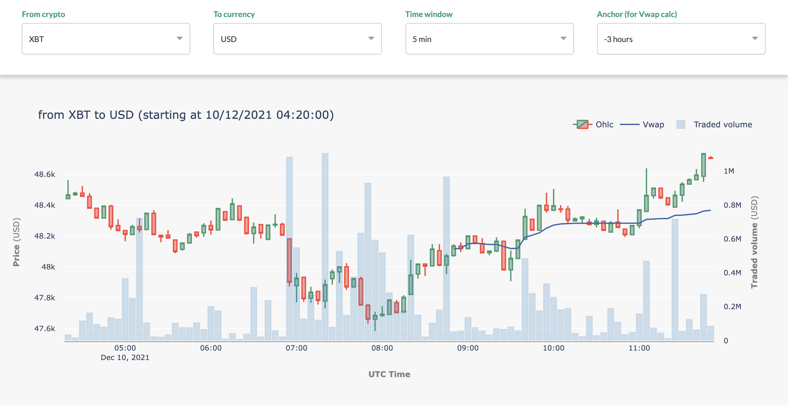

# crypto-rlslr

 <font size=1><em>[link](https://github.com/raulsolera/crypto-rlslr/blob/main/README.md)
 a este documento en github.</em></font> 

<em>Este proyecto se ha realizado como trabajo para la asignatura "Python para
Análisis de datos" del Master en
[Big Data Science de la Universidad de Navarra](https://mstr.unav.edu/master-big-data-science/).
</em>

### Descripción funcional

El proyecto consiste en mostrar una serie de gráficas de inversión de un par de
monedas (cryptomoneda frente a moneda estándar). Los gráficos que se muestran
son el OHLC (Open, High, Low, Close), el Vwap y el volumen negociado según se
puede ver en el siguiente ejemplo:



La información de las cotizaciones se obtiene de [Kraken](https://www.kraken.com/)
llamando a su API pública
([ejemplo](https://api.kraken.com/0/public/Trades?pair=XETHZEUR&since=157406713999999999))
utilizando la librería estándar
[urllib.request](https://docs.python.org/3/library/urllib.request.html)
sin necesidad de instalar la
[librería propia de kraken](https://support.kraken.com/hc/en-us/articles/360025180232-Kraken-REST-API-command-line-client).
Dado que el proyecto utiliza exclusivamente datos públicos se ha considerado más 
conveniente no tener que hacer instalaciones adicionales.

Si bien para los gráficos
[OHLC](https://en.wikipedia.org/wiki/Open-high-low-close_chart) y Volumen
negociado existen numerosas referencias, no es así para el cálculo del Vwap.
En este proyecto, por defecto se emplea la versión que consideramos estándar:
precio típico ponderado por volumen acumulado desde un momento ancla
"anchor time"
([ejemplo de cálculo en spreadsheet](https://docs.google.com/spreadsheets/d/143nJ1dhsr6GTQr9Wr8kQby6rOqBGMS9BTrhz5AWNMsY/edit#gid=1559753437)),
método para el cual se han encontrado nuemeros referencias
([investopia](https://www.investopedia.com/terms/v/vwap.asp).
[tradingview](https://www.tradingview.com/scripts/vwap/?solution=43000502018)...),
Sin embargo en el proyecto también se permite la representación del Vwap sin
ancla temporal de referencia (aunque entedemos que en ese caso aporta poca
informacón adicional
al gráfico OHLC).

Las referencias estándar para el cálculo del Vwap suelen fijar el ancla temporal
en el inicio de la sesión. En el caso de las criptomonedas (que no cotizan en
mercados con sesiones diarias con apertura y cierre sino que tienen una
cotización continua) se ha tomado la decisión de permitir fijar el Vwap desde
una serie de horas hacia atrás desde el momento actual. Por defecto se toman -6
horas pero es un parámetro modificable por el usuario.

Algo caraterístico de estos tres gráficos es que en los tres casos se basan en
una ventana temporal, y por tanto para represetación gráfica por pantalla se ha
basado en un número fijo de ventanas temporales que se ha considerado cómoda
(este número se podría haber dejado como un parámetro de usuario pero de
momento se ha fijado en 90 ventanas completas más la ventana actual (que aún no
se ha completado)). Para clarificar se explicará con un ejemplo:

> Si en el momento de genera el gráfico son las 7:49 horas de la mañana y se ha
> elegido una ventana de 5 minutos, se considera que la última ventana completa
> termina a las 7:45 y desde esa referencia se muestran 90 ventanas completas
> que son 450 minutos o 7:30 horas por lo que la hora inicial serán las 0:15
> horas.

El tamaño de la ventana se ha fijado por defecto en 5 minutos pero al igual que
el ancla temporal para el cálculo del Vwap puede ser modificado por el usuario.

Por tanto el usuario podrá actuar sobre 3 parámetros: 


* <b>Par de monedas</b>, eligiendo cryptomoneda (de momento ETH - Ethereum, XBT -
Bitcoin) origen y moneda estándar (USD - Dolar, EUR - Euro) destino (por
defecto ETH - Ethereum y EUR - Euro)
* <b>Tamaño de la ventana</b> para los gráficos pudiendo eleigir distintas ventanas
desde 30 segundos hasta 15 minutos (por defecto 5 minutos)
* <b>Tiempo ancla</b> (en número de horas hacia atrás) desde el que se fija el acumulado
para el cálculo del Vwap desde -24 horas hasta sin ancla (por defecto -6 horas) 

Que adaptan la visualización a las opciones deseadas, como se puede ver eb
los siguientes ejemplos:

 

### Instalación y dependecias:
El proyecto se ha desarrollado en python 3.9.7 y tiene los requerimientos
especificados en el fichero
[requirements.txt](https://github.com/raulsolera/crypto-rlslr/blob/main/requirements.txt).
La instalación recomendada es la siguiente:
1. Descargar el zip de github ([download](https://github.com/raulsolera/crypto-rlslr/archive/refs/heads/main.zip)),
2. Descomprimir
3. Acceder a la carpeta crypto-rlslr-main desde el terminal
4. Crear entorno virtual ```python3 -m venv .```
5. Activar entorno virtual ```source bin/activate``` en Unix o MacOS
```Scripts\activate.bat``` en windows
6. Instalar requirements.txt ```pip install -r requirements.txt```
7. Lanzar la aplicación ```python3 app.py```
8. Acceder al [servidor local](http://127.0.0.1:8050/) desde un navegador 

### Descripción técnica:
El proyecto se construido en python 3.9 en un entorno virtual
[pyenv](https://docs.python.org/3/tutorial/venv.html).

Para la visualización se han utilizando el framework
[dash](https://plotly.com/dash/)
y la librería gráfica [plotly](https://plotly.com/python/) y la librería pandas
para la agregación de trades y cálculo de Vwap, OHLC...

La descarga de la información de la API pública de Kraken se ha gestionado con
los módulos urllib.request y json.

Se ha utilizado [git](https://git-scm.com/) para el control de cambios y
[github](https://github.com/raulsolera/crypto-rlslr) como repositorio remoto.

En todo el desarrollo se ha seguido el estándar de codificación
[pep8](https://www.python.org/dev/peps/pep-0008/) asegurado por el IDE pycharm
y además se ha verificado utilizando el módulo
[flake8](https://flake8.pycqa.org/en/latest/).

#### Estructura de la aplicación:
La aplicación se ha organizado en tres ficheros .py y un fichero .css para
la hoja de estilos:
* [app.py](https://github.com/raulsolera/crypto-rlslr/blob/main/app.py):
contiene el código principal de la aplicación: la definición del servidor, 
el layout, y la función de actualizción de los gráficos
* [classes.py](https://github.com/raulsolera/crypto-rlslr/blob/main/classes.py):
incluye la definición de las clases para facilitar el proceso:
    - <b>KrakenTrades</b>: encapsula toda la funcionlidad para la llamada a la
  api de kraken pasando solo un par de monedas y una fecha inicial, llamando a
  la funcion ```update_trades``` 1) si no ha cargado cotizaciones las carga, 2) 
  si tiene cargadas cotizaciones para el mismo par de monedas actualiza las 
  cotizaciones desde la última disponible 3) si se cambia de par o se piden
  cotizaciones desde una fecha anterior vuelve a recargar las cotizaciones (
  posible mejora que luego se detallará)
    - <b>GroupedTrades</b>: se encarga de la agregación de los trades en las
  ventanas definidas y el cálculo del vwap desde el momento ancla establecido. 
  Es clave en esta clase el uso de la clase
  [pandas.Grouper](https://pandas.pydata.org/docs/reference/api/pandas.Grouper.html)
  que permite agrupar los trades en ventanas de tiempo predefinidas con una
  facilidad asombrosa:
        ```
        # Aggregate trades
        self.values = \
            _trades.groupby(pd.Grouper(freq=self.frequency, label='left')). \
            agg(Volume=('Volume', 'sum'), Value=('Value', 'sum'),
                Open=('Price', 'first'), High=('Price', 'max'),
                Low=('Price', 'min'), Close=('Price', 'last'))
        ```
      - <b>TimeParams</b>: finalmente esta clase facilita el cálculo de las
  ventanas temporales, momento ancla, etc...
* [utils.py](https://github.com/raulsolera/crypto-rlslr/blob/main/utils.py): en
este fichero se incluye toda la información de parámetros de control, opciones
posibles para desplegables y algunas funciones básicas para cálculos temporales.

* [assets/style.css](https://github.com/raulsolera/crypto-rlslr/blob/main/assets/style.css):
en este fichero se definen los estilos empleados en para la definición del 
lay out de la aplicación.


### Limitaciones:


### Actualizaciones deseables:
Aunque el objetivo del proyecto se ha completado, sin hay una serie de mejoras
que no se han podido desarrollar por falta de tiempo:
- Toda la información se mnuestra en hora UTC, ha quedado pendiente adaptar la
hora a la franja horaria local de la ejecución.
- en la clase ```KrakenTrades``` cuando se llama al método
```update_trades``` con una fecha-hora anterior a la del primer trade cargado
por facilidad se vuelven a cargar todos los trades desde la fecha de inicio 
hasta el momento actual desaprovechando los trades ya cargados, esto podría
suponer una mejora de rendimiento relevante.
- Ha quedado pendiente mejorar la selección del momento ancla para el cálculo 
de vwap, y añadir algunas opciones en los menús como el número de ventanas 
mostradas en lugar de ser un fijo de 90. Además la anotación del gráfico
podría ser algo más elaborada.
- También me ha quedado por añadir una actualización en vivo de los trades, se
puede hacer con muy poco esfuerzo y he lamentado no haber tenido tiempo de
incorporarlo a la aplicación.
